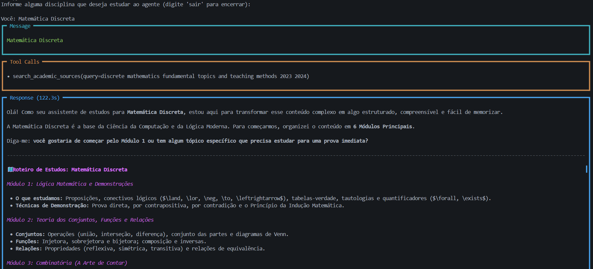
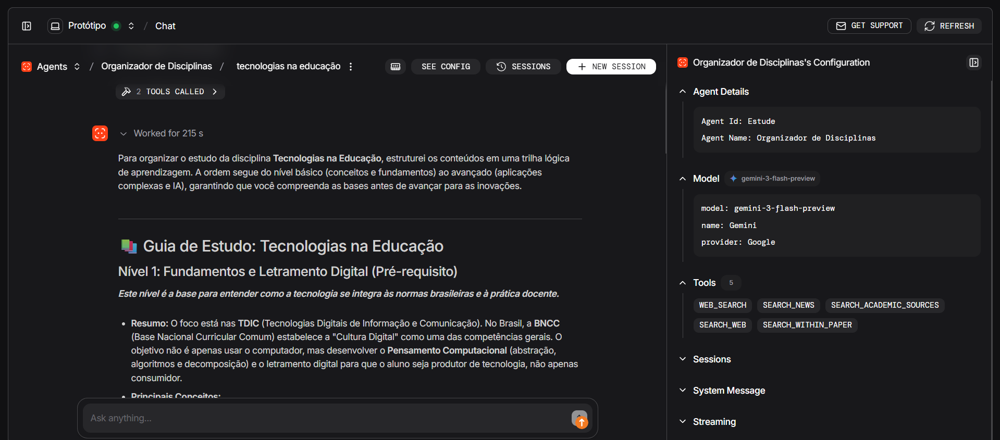
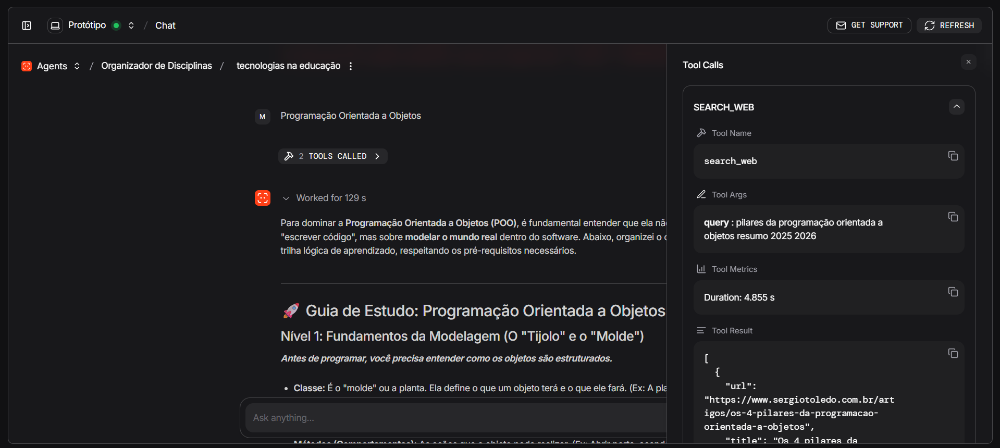
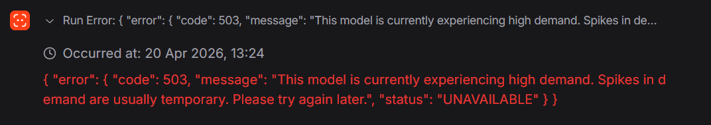
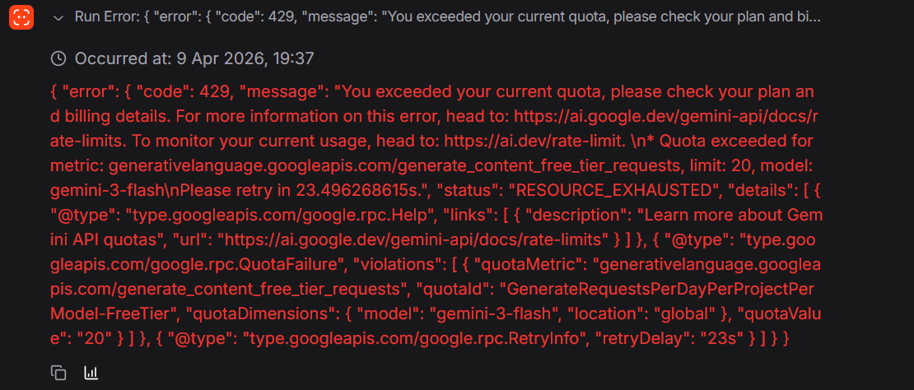

# Projeto - Tecnologias na Educação
Projeto de um agente de IA para a disciplina de Tecnologias na Educação

## Descrição
Integração de um agente de IA com técnicas de Learning Analytics para criar um sistema de aprendizagem inteligente e personalizado, no qual o agente atua como um tutor virtual que organiza e estrutura automaticamente os conteúdos da disciplina, gerando resumos, exercícios e revisões periódicas, enquanto coleta e analisa dados das interações do estudante, como desempenho, tempo de estudo e padrões de erro, permitindo identificar dificuldades e lacunas de conhecimento; com base nessas análises, o agente adapta continuamente o processo de aprendizagem, ajustando a sequência dos conteúdos, reforçando temas mais complexos e personalizando estratégias de estudo, tornando o aprendizado mais eficiente, organizado e com maior retenção.

## Tecnologias

### Pré-requisitos

- [Python 3.14+](https://www.python.org/)
- [UV](https://docs.astral.sh/uv/)
- [FastAPI](https://fastapi.tiangolo.com/)

### Tecnologias do Agente
- [Agno](https://www.agno.com/)
- [Google Gemini API](https://aistudio.google.com/)

### Ferramentas utilizadas pelo agente
- [DuckDuckGo](https://duckduckgo.com/)
- [Valyu](https://www.valyu.ai/)

## Passo a passo

### Comandos para rodar o projeto:

- Entrar na pasta do backend: "**cd \api_rest_back**" 
- Sincronizar o repositório: "**uv sync**"
- Criar o arquivo "**.env**" com as chaves VALYU_API_KEY e GOOGLE_API_KEY
- Navegue até o .venv: "**& api_rest_back\\.venv\Scripts\Activate.ps1**" ou "**.venv\Scripts\activate**"
- Execute o fastAPI: "**fastapi dev api_rest_back/api/main.py**"
- Acesse o **[localhost](http://127.0.0.1:8000)** ou acesse a [documentação](http://127.0.0.1:8000/docs)

## Demonstração

### Exemplo Terminal 

### Exemplo Agno OS

### Possíveis Erros

