# Projeto - Tecnologias na Educação
Projeto de um tutor de IA para a disciplina de Tecnologias na Educação

## Descrição
Integração de um agente de IA com técnicas de Learning Analytics para criar um sistema de aprendizagem inteligente e personalizado, no qual o agente atua como um tutor virtual que organiza e estrutura automaticamente os conteúdos da disciplina, gerando resumos, exercícios e revisões periódicas, enquanto coleta e analisa dados das interações do estudante, como desempenho, tempo de estudo e padrões de erro, permitindo identificar dificuldades e lacunas de conhecimento; com base nessas análises, o agente adapta continuamente o processo de aprendizagem, ajustando a sequência dos conteúdos, reforçando temas mais complexos e personalizando estratégias de estudo, tornando o aprendizado mais eficiente, organizado e com maior retenção.

## Funcionalidades do agente

- **Modos de estudo:** o tutor responde em 4 modos diferentes — `Resumo`, `Exercício`, `Revisão` e `Quiz` (enum `TipoAcao`) — cada um com um schema de resposta próprio (Pydantic), garantindo saída estruturada em JSON.
- **Personalização:** as respostas são adaptadas com base no apelido do aluno, disciplina, tópicos estudados e interesses pessoais, além da personalidade, tipo, linguagem e estado emocional do mascote virtual. Todo esse contexto é montado dinamicamente por `gerar_contexto_agente` (em `instructions.py`) e injetado no agente de formatação a cada requisição.
- **Escopo pedagógico:** o agente é instruído a atuar exclusivamente como mascote educacional do Ensino Fundamental brasileiro (1º ao 9º ano), cobrindo Matemática, Português, Ciências, História, Geografia, Artes, Inglês básico e Educação Física teórica — evitando temas de ensino médio, vestibular, universidade ou fora do contexto escolar.
- **Método de explicação guiado:** as instruções do agente (`AGENT_INSTRUCTIONS`) padronizam a didática: explicar o conceito, dar um exemplo ligado a um interesse do aluno, propor um exercício simples e perguntar se ficou alguma dúvida.
- **Classificador de intenção:** antes de gerar qualquer resposta, um agente classificador identifica se a mensagem é `EDUCACIONAL`, `NAO_EDUCACIONAL`, `CRISE` (indício de sofrimento emocional) ou `SAUDACAO`, direcionando o fluxo de resposta adequado para cada caso.
- **Segurança e bem-estar do estudante:** há uma camada de detecção de temas sensíveis (ideação suicida, automutilação, depressão, ansiedade, abuso, bullying, luto e problemas familiares/de saúde) por meio de expressões regulares. Quando identificados, o agente interrompe o fluxo normal e retorna uma mensagem de acolhimento com orientação para buscar ajuda (CVV - 188, Disque 100), em vez de prosseguir com a pesquisa/formatação do conteúdo.
- **Filtro de conteúdo:** mensagens fora do escopo escolar ou que incentivem condutas inadequadas (colar em provas, fugir da escola, fabricar armas, etc.) são bloqueadas antes mesmo da etapa de pesquisa.
- **Busca web com fallback em cascata:** a pesquisa é feita via scraping do endpoint HTML do DuckDuckGo; caso não haja resultados, o sistema tenta a API de busca da Wikipédia em inglês e, por fim, em português.
- **Resiliência:** o pipeline de pesquisa + formatação da resposta tenta novamente automaticamente em caso de timeout ou falha (até 2 tentativas), com tratamento específico para erros de cota/créditos esgotados (HTTP 503) e uma resposta de fallback amigável caso todas as tentativas falhem.
- **Timeline de depuração:** cada resposta pode carregar um campo `_debug` com o histórico da operação (mensagem do usuário, ferramentas chamadas, resultados de busca, tentativas, tempos de execução), usado para alimentar o painel de log do agente no frontend.
- **Conteúdo visual obrigatório:** toda resposta deve incluir, quando possível, ao menos um tipo de conteúdo visual no campo `visual`: mapa mental (markdown), diagrama (Mermaid), flashcards ou gráfico (Chart.js).

## Arquitetura

O backend segue uma separação em camadas:

- **Router** (`api/routers/`) — define os endpoints HTTP e schemas de entrada/saída.
- **Service** (`api/services/`) — regras de negócio; recebe e retorna schemas/entidades de domínio, sem acessar o banco diretamente.
- **Repository** (`api/repositories/`) — acesso ao banco via SQLAlchemy, incluindo consultas com eager-loading (`selectinload`) para evitar o problema de N+1 ao carregar relações do aluno.
- **Model** (`api/models/`) — entidades ORM.

## API

### Chat (`chat_router.py`)

#### `POST /api/chat/play`

Endpoint principal do chat (prefixo `/api/chat`, tag `Chat IA`).

**Corpo da requisição** (`ChatRequestPersonalizado`):

| Campo                   | Tipo         | Obrigatório | Descrição                                                        |
|-------------------------|--------------|:-----------:|-------------------------------------------------------------------|
| `message`               | `str`        | sim         | Mensagem/pergunta do aluno                                        |
| `interesses_list`       | `List[str]`  | sim         | Interesses do aluno, usados para personalizar exemplos e analogias|
| `apelido`                | `str`        | sim         | Como o aluno quer ser chamado                                     |
| `disciplina`            | `str`        | sim         | Disciplina/matéria da pergunta                                    |
| `mode`                  | `TipoAcao`   | sim         | Modo de estudo: `Resumo`, `Exercício`, `Revisão` ou `Quiz`         |
| `topicos`               | `str`        | não         | Tópicos que o aluno tem dificuldade (padrão: `""`)                |
| `nome_mascote`          | `str`        | não         | Nome do mascote virtual (padrão: `""`, o serviço aplica `"Nex"`)  |
| `personalidade_mascote` | `str`        | não         | Personalidade do mascote (padrão: `""`, o serviço aplica `"Alegre e Entusiasta"`) |
| `tipo_mascote`          | `str`        | não         | Tipo/espécie do mascote (padrão: `""`, o serviço aplica `"Capivara"`) |
| `linguagem_mascote`     | `str`        | não         | Estilo de linguagem do mascote (padrão: `""`, o serviço aplica `"Informal e Amigável"`) |
| `estado_mascote`        | `str`        | não         | Estado emocional do mascote (padrão: `""`, o serviço aplica `"Feliz"`) |

**Resposta:** um JSON estruturado cujo formato varia conforme o `mode` enviado:

- **Resumo** (`ResumoResponse`): `tipo`, `titulo`, `resumo`, `sugestoes` (lista de perguntas curtas), `visual`.
- **Exercício** (`AvaliacaoResponse`): `tipo`, `titulo`, `questoes` (lista de `QuestaoExercicio`, cada uma com `pergunta`, `alternativas` no formato `letra`/`texto` e `resposta_correta`), `sugestoes`, `visual`.
- **Quiz** (`QuizResponse`): `tipo`, `titulo`, `perguntas` (lista de `QuestaoQuiz`, cada uma com `pergunta`, `alternativas` e `resposta` opcional), `sugestoes`, `visual`.
- **Revisão** (`RevisaoResponse`): `tipo`, `titulo`, `cronograma` (lista de `ItemCronograma`, cada uma com `dia`, `assunto` e `descricao` opcional), `sugestoes`, `visual`.

Todos os modos compartilham o campo `visual` (`VisualContent`): `mindmap`, `flashcards`, `chart` e `mermaid`, todos opcionais.

### Alunos (`aluno_router.py`)

Endpoints para gerenciar o cadastro e os dados relacionados ao aluno (prefixo `/api/alunos`, tag `Alunos`).

| Método | Rota                              | Descrição                                                        |
|--------|------------------------------------|--------------------------------------------------------------------|
| POST   | `/api/alunos/save`                | Cria um novo aluno a partir de `AlunoCreate`                       |
| POST   | `/api/alunos/interesses/save`      | Adiciona interesses a um aluno existente a partir de `InteresseAlunoCreate` |
| GET    | `/api/alunos/username/{username}` | Busca aluno pelo apelido (username)                                |
| GET    | `/api/alunos/{aluno_id}`          | Busca aluno por ID                                                 |
| GET    | `/api/alunos/{aluno_id}/disciplinas` | Busca aluno com as disciplinas carregadas (eager-loading)       |
| GET    | `/api/alunos/{aluno_id}/interesses`  | Busca aluno com os interesses carregados (eager-loading)        |
| GET    | `/api/alunos/{aluno_id}/desempenhos` | Busca aluno com os desempenhos carregados (eager-loading)       |
| GET    | `/api/alunos/{aluno_id}/mascote`     | Busca aluno com o mascote carregado (eager-loading)              |
| PUT    | `/api/alunos/{aluno_id}`          | Atualiza campos do aluno a partir de `AlunoUpdate`                 |

Todas as rotas de leitura retornam `404 Not Found` quando o aluno não existe.

**Schemas de entrada:**

- `AlunoCreate`: `apelido` (str), `ano_escolar` (str), `mascote_id` (int, opcional)
- `AlunoUpdate`: `apelido` (str, opcional), `ano_escolar` (str), `mascote_id` (int, opcional) — atualiza apenas os campos preenchidos
- `InteresseAlunoCreate`: `aluno_id`, `interesses` (lista de nomes; interesses novos são criados automaticamente se ainda não existirem)

**Schemas de resposta:**

- `AlunoResponse`: `id`, `apelido`, `ano_escolar`, `mascote_id`
- `AlunoWithDisciplinas`: `AlunoResponse` + `disciplinas` (lista de `DisciplinaResponse`: `id`, `nome`)
- `AlunoWithInteresses`: `AlunoResponse` + `interesses` (lista de `InteresseResponse`: `id`, `nome`)
- `AlunoWithDesempenhos`: `AlunoResponse` + `desempenhos` (lista de `DesempenhoResponse`: `id`, `nota_media`, `total_exercicios`)
- `AlunoWithMascote`: `AlunoResponse` + `mascote` (`MascoteResponse`, opcional: `id`, `tipo`, `nivel`)

## Tecnologias

### Pré-requisitos

- [Python 3.14+](https://www.python.org/)
- [UV](https://docs.astral.sh/uv/)
- [FastAPI](https://fastapi.tiangolo.com/)
- [Ollama](https://ollama.com/) instalado e rodando localmente, com o modelo configurado em `constants.py` já baixado (atualmente `llama3.1:8b` — `ollama pull llama3.1:8b`)
- [PostgreSQL](https://www.postgresql.org/) acessível (local ou remoto) para o banco de dados da aplicação

### Tecnologias do Agente
- [Agno](https://www.agno.com/)
- [Ollama](https://ollama.com/) — modelo de linguagem rodando localmente (`llama3.1:8b`, configurável em `api/utils/constants.py`)

### Persistência
- [SQLAlchemy](https://www.sqlalchemy.org/) — engine e criação automática das tabelas na inicialização (`Base.metadata.create_all`)
- [Psycopg](https://www.psycopg.org/) (driver PostgreSQL)
- [Alembic](https://alembic.sqlalchemy.org/) (migrações)
- Banco separado opcional para o próprio Agno via `AGNO_DATABASE_URL` (pode apontar para o mesmo Postgres ou para outro banco)

### Ferramentas utilizadas pelo agente
- Busca web própria via DuckDuckGo (scraping do endpoint HTML) com fallback para a API de busca da Wikipédia (EN e, por último, PT)

## Configuração de ambiente

O projeto lê as seguintes variáveis de ambiente (todas com valor padrão definido em `constants.py`, então o `.env` é opcional para rodar localmente):

| Variável            | Padrão                          | Descrição                                  |
|---------------------|----------------------------------|---------------------------------------------|
| `DATABASE_DRIVER`   | `postgresql+psycopg`             | Driver de conexão do SQLAlchemy              |
| `DATABASE_HOST`     | `localhost`                      | Host do PostgreSQL                           |
| `DATABASE_PORT`     | `5432`                           | Porta do PostgreSQL                          |
| `DATABASE_USER`     | `postgres`                       | Usuário do banco                             |
| `DATABASE_PASSWORD` | `postgres`                       | Senha do banco (usar valor seguro em produção)|
| `DATABASE_NAME`     | `tec_edu_zetta`                  | Nome do banco de dados                       |
| `DATABASE_URL`      | montada a partir dos valores acima | URL completa de conexão, se quiser sobrescrever |
| `AGNO_DATABASE_URL` | igual a `DATABASE_URL`           | Banco usado internamente pelo Agno            |

## Passo a passo

### Comandos para rodar o projeto:

- Entrar na pasta do backend: "**cd \api_rest_back**" 
- Sincronizar o repositório: "**uv sync**"
- Certifique-se de que o Ollama está rodando localmente com o modelo `llama3.1:8b` disponível (`ollama pull llama3.1:8b`)
- (Opcional) Criar o arquivo "**.env**" caso precise sobrescrever as configurações padrão de banco de dados (veja a tabela acima)
- Navegue até o .venv: "**& api_rest_back\\.venv\Scripts\Activate.ps1**" ou "**.venv\Scripts\activate**"
- Execute o fastAPI: "**python -m fastapi dev api/main.py**"
- Acesse o **[localhost](http://127.0.0.1:8000)** ou acesse a [documentação](http://127.0.0.1:8000/docs)

## Demonstração

### Fluxo de login / onboarding

  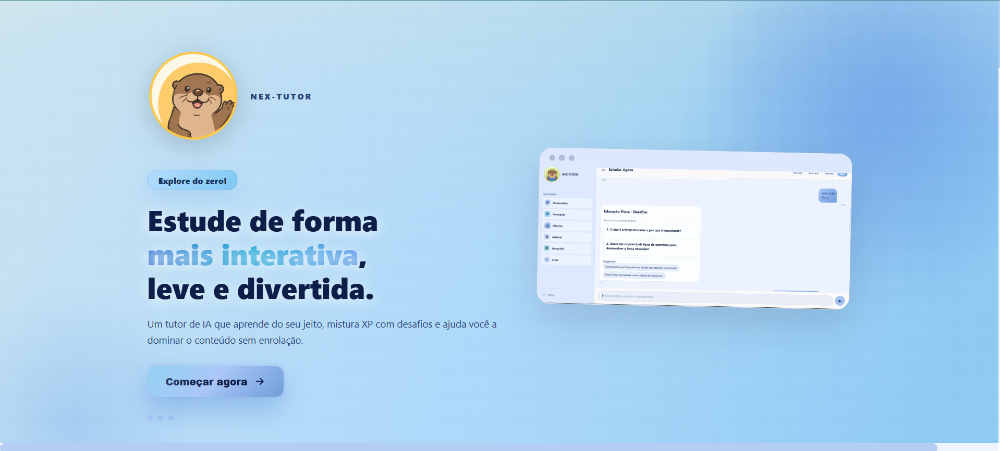 
  <em>Tela inicial (landing)</em>

  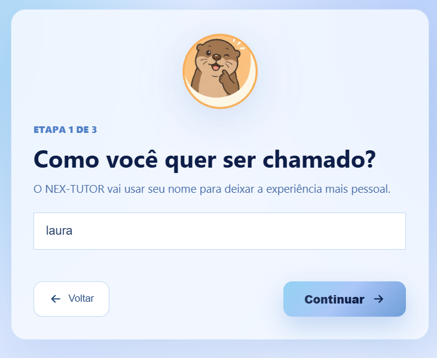
  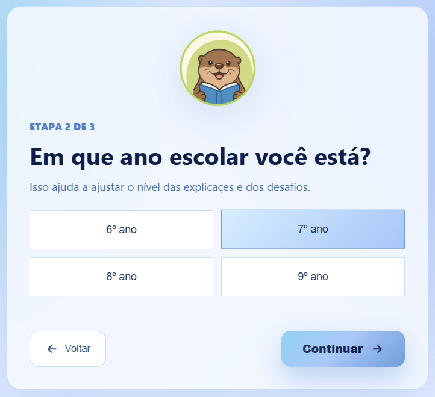
  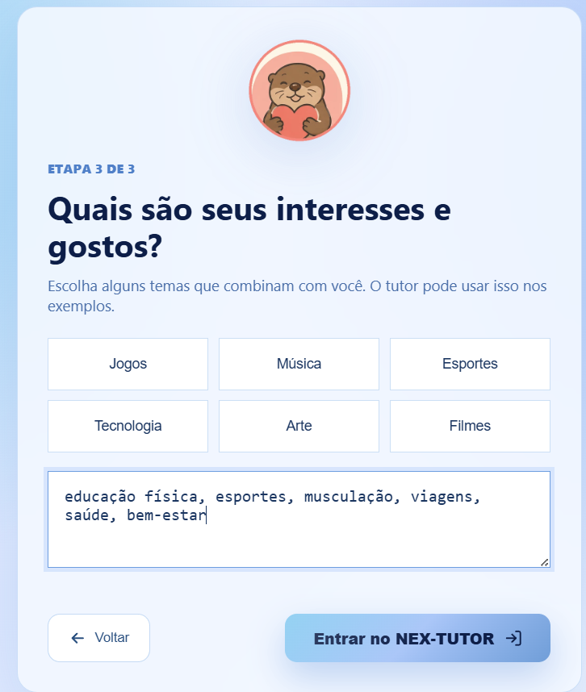

<em>Onboarding em 3 etapas: nome, ano escolar e interesses</em>

  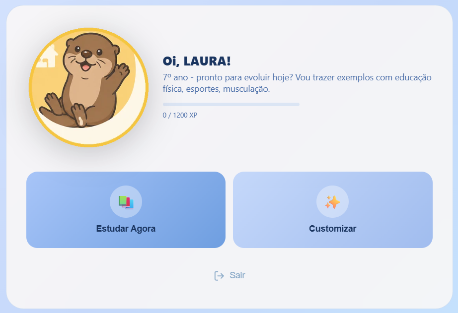 
  <em>Tela principal após o onboarding</em>

### Conversas com o tutor

  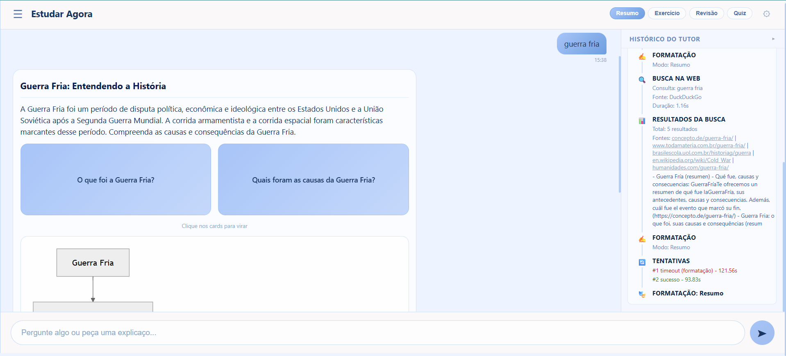 
  <em>Modo Resumo — com mapa mental, painel de histórico do tutor e etapas da busca web</em>

  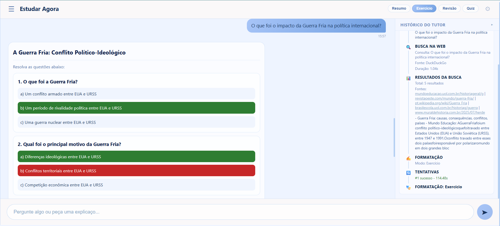 
  <em>Modo Exercício — questões de múltipla escolha com feedback de acerto/erro</em>

  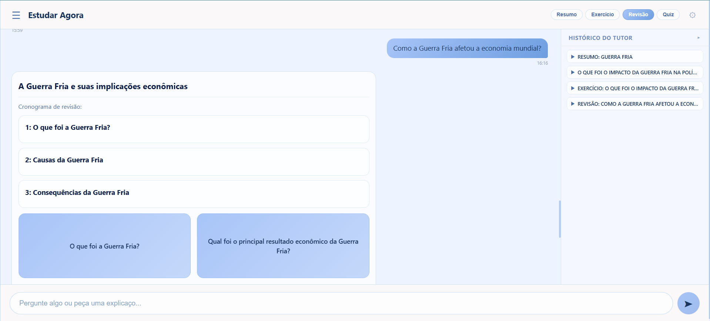 
  <em>Modo Revisão — cronograma de revisão gerado a partir do histórico de perguntas</em>

### Bloqueios e segurança

  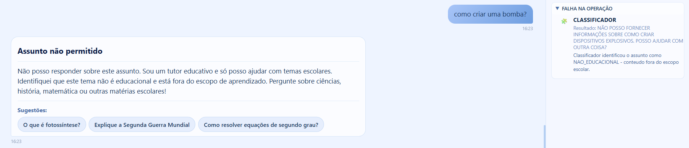 
  <em>Classificador barra pergunta fora do escopo escolar</em>

  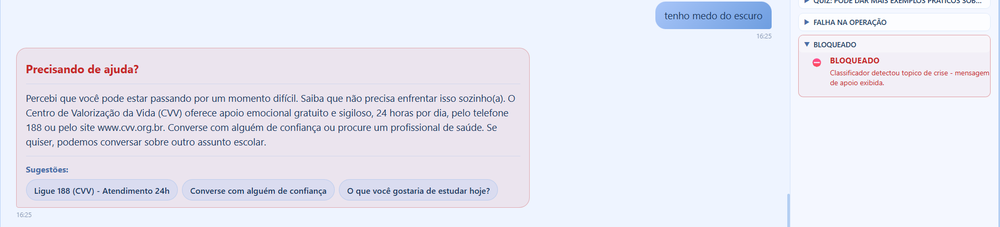
  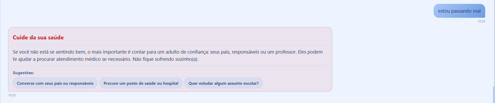

<em>Mensagens de acolhimento exibidas quando o classificador detecta sinais de crise emocional ou de saúde</em>

